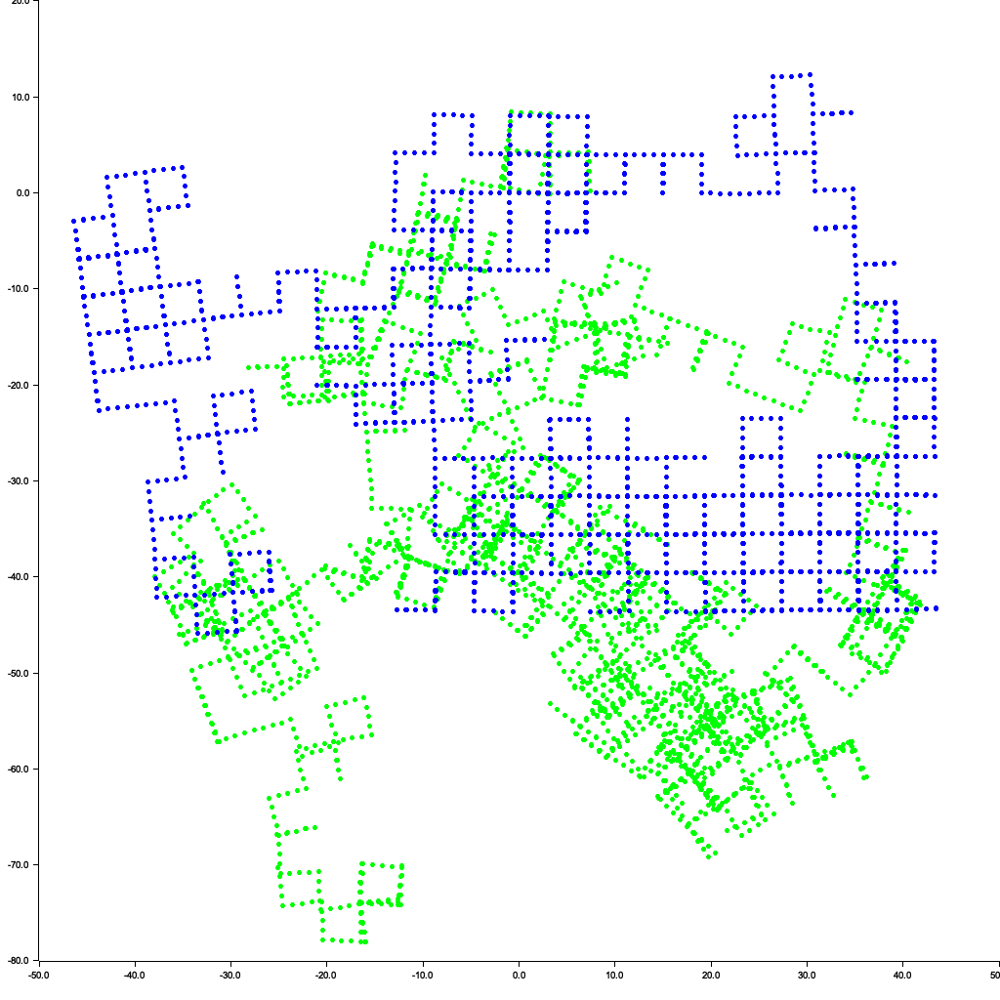
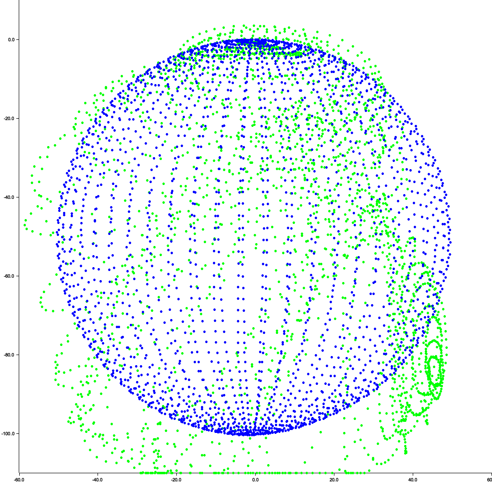
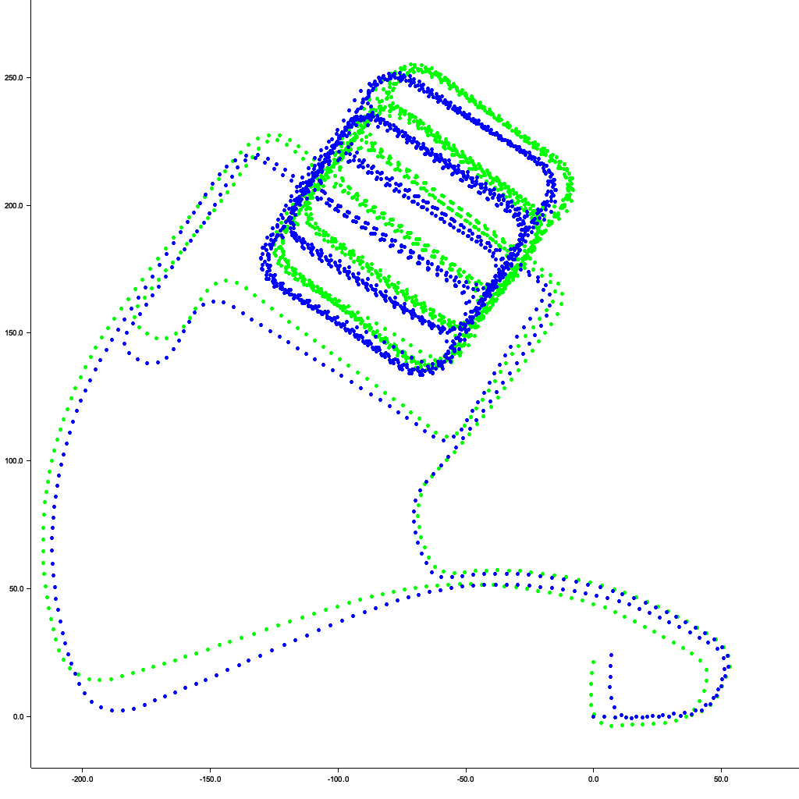

# tiny-solver-rs
[](https://crates.io/crates/tiny-solver)
[](https://pypi.org/project/tiny-solver)
[](https://pypi.org/project/tiny-solver)

Inspired by [ceres-solver](https://github.com/ceres-solver/ceres-solver), [tiny-solver](https://github.com/keir/tinysolver), and [minisam](https://github.com/dongjing3309/minisam).

This is a general optimizer written in Rust, including bindings for Python. If you're familiar with ceres-solver or factor-graph optimizers, you'll find it very easy to use.

#### Other great rust optimizers
* [fact.rs](https://github.com/rpl-cmu/fact.rs)
* [sophus-rs](https://github.com/sophus-vision/sophus-rs)

## Installation
### rust
```sh
cargo add tiny-solver
```

## Current Features

- [x] Automatic Derivatives using [num-dual](https://github.com/itt-ustutt/num-dual)
- [x] Sparse QR, Sparse Cholesky using [faer](https://github.com/sarah-quinones/faer-rs)
- [x] GaussNewtonOptimizer
- [x] LevenbergMarquardtOptimizer
- [x] Multithreading jacobian
- [x] loss functions (Huber, CauchyLoss, ArctanLoss)
- [x] Parameter on manifold (SO3, SE3)

#### TODO
- [ ] information matrix

## Benchmark
On m3 macbook air
| dataset | tiny-solver | gtsam   | minisam  |
|---------|-------------|---------|----------|
| m3500   | 128.3ms     | 130.7ms | 123.6 ms |

It's not extremely optimized, but it's easy to install and use.

## Usage
Rust 
```rust
// define your own Cost/Factor struct
// impl residual function
// and the jacobian will be auto generated
use nalgebra as na;
struct CustomFactor {}
impl<T: na::RealField> tiny_solver::factors::Factor<T> for CustomFactor {
    fn residual_func(&self, params: &[nalgebra::DVector<T>]) -> nalgebra::DVector<T> {
        let x = &params[0][0];
        let y = &params[1][0];
        let z = &params[1][1];

        na::dvector![
            x.clone()
                + y.clone() * T::from_f64(2.0).unwrap()
                + z.clone() * T::from_f64(4.0).unwrap(),
            y.clone() * z.clone()
        ]
    }
}

fn main() {
    // init logger, `export RUST_LOG=trace` to see more log
    env_logger::init();

    // init problem (factor graph)
    let mut problem = tiny_solver::Problem::new();

    // add residual blocks (factors)
    // add residual x needs to be close to 3.0
    problem.add_residual_block(
        1,
        &["x"],
        Box::new(tiny_solver::factors::PriorFactor {
            v: na::dvector![3.0],
        }),
        None,
    );
    // add custom residual for x and yz
    problem.add_residual_block(2, &["x", "yz"], Box::new(CustomFactor), None);

    // the initial values for x is 0.7 and yz is [-30.2, 123.4]
    let initial_values = HashMap::<String, na::DVector<f64>>::from([
        ("x".to_string(), na::dvector![0.7]),
        ("yz".to_string(), na::dvector![-30.2, 123.4]),
    ]);

    // initialize optimizer
    let optimizer = tiny_solver::GaussNewtonOptimizer::new();

    // optimize
    let result = optimizer.optimize(&problem, &initial_values, None);

    // result
    for (k, v) in result {
        println!("{}: {}", k, v);
    }
}
```
Python (Currently not maintaining)
```py
import numpy as np
from tiny_solver import Problem, GaussNewtonOptimizer
from tiny_solver.factors import PriorFactor, PyFactor

# define custom cost function in python
# the trade off is the jacobian for the problem cannot be done in parallel
# because of gil
def cost(x: np.ndarray, yz: np.ndarray) -> np.ndarray:
    r0 = x[0] + 2 * yz[0] + 4 * yz[1]
    r1 = yz[0] * yz[0]
    return np.array([r0, r1])


def main():

    # initialize problem (factor graph)
    problem = Problem()

    # factor defined in python
    custom_factor = PyFactor(cost)
    problem.add_residual_block(
        2,
        [
            ("x", 1),
            ("yz", 2),
        ],
        custom_factor,
        None,
    )

    # prior factor import from rust
    prior_factor = PriorFactor(np.array([3.0]))
    problem.add_residual_block(1, [("x", 1)], prior_factor, None)

    # initial values
    init_values = {"x": np.array([0.7]), "yz": np.array([-30.2, 123.4])}

    # optimizer
    optimizer = GaussNewtonOptimizer()
    result_values = optimizer.optimize(problem, init_values)

    # result
    for k, v in result_values.items():
        print(f"{k}: {v}")


if __name__ == "__main__":
    main()
```

## Example
### Basic example
```sh
cargo run -r --example small_problem
```
### M3500 dataset


```sh
git clone https://github.com/powei-lin/tiny-solver-rs.git
cd tiny-solver-rs

# run rust version
cargo run -r --example m3500_benchmark

# run python version
pip install tiny-solver matplotlib
python3 examples/python/m3500.py
```
### Sphere 2500 dataset
```
cargo run -r --example sphere2500
```


### Parking garage dataset
```
cargo run -r --example parking-garage
```

